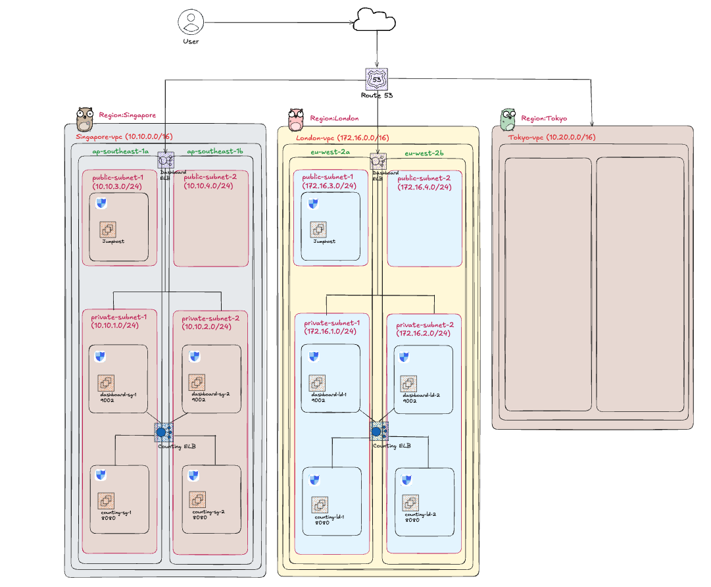
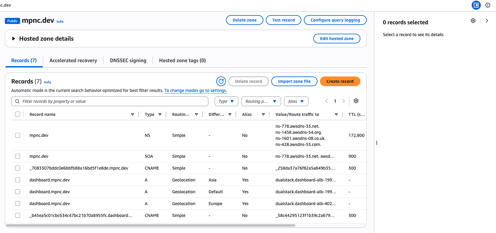
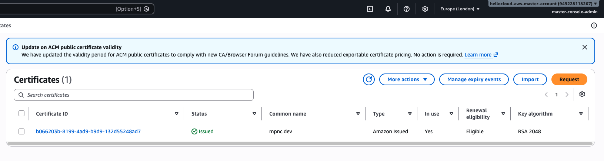
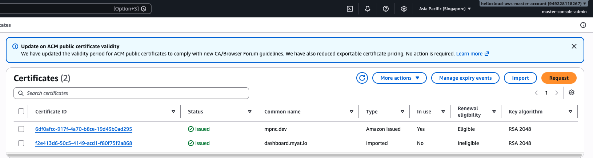
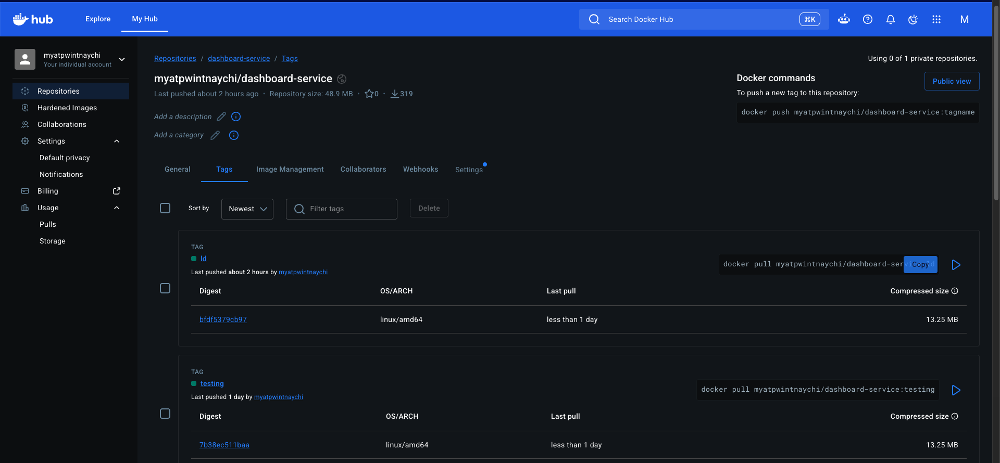
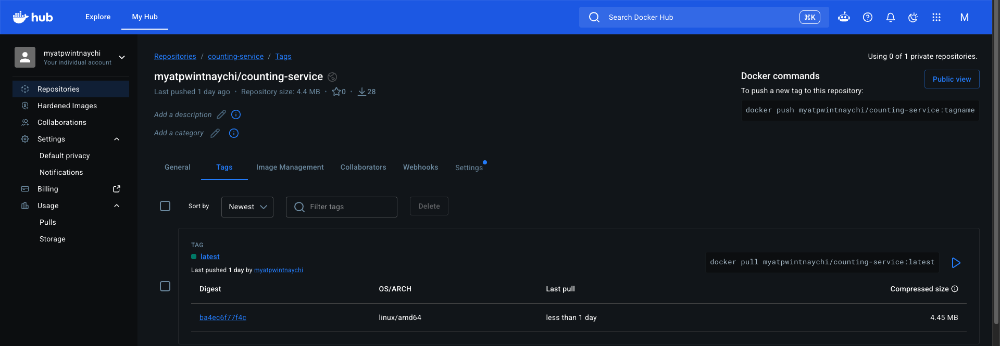
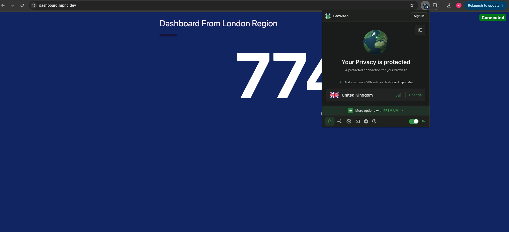
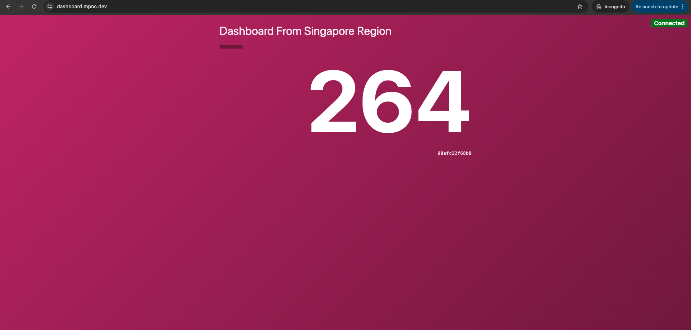
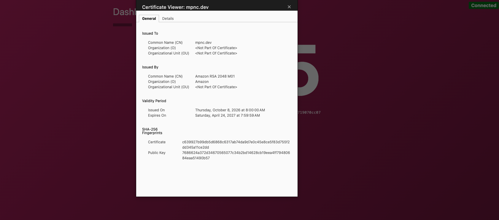

# Multi-Region Geolocation Routing Architecture with AWS Route 53 & Docker

This project demonstrates a highly available, multi-region web application deployment utilizing **AWS Route 53 Geolocation Routing**. Users are intelligently routed to the nearest regional stack (**Singapore** or **London**) based on their geographical location, ensuring minimal latency and optimized traffic management.

The microservices architecture consists of custom Docker containerized services (`dashboard-service` and `counting-service`) built, tagged, and pushed to Docker Hub, deployed inside isolated AWS VPCs, and secured with SSL/TLS certificates via AWS Certificate Manager (ACM).

---

## Architecture Overview


The system is deployed across two primary AWS Regions:
* **Singapore (`ap-southeast-1`) (10.10.0.0/16)** spanning Availability Zones ap-southeast-1a and ap-southeast-1b.
* **London (`eu-west-2`) (172.16.0.0/16)** spanning Availability Zones eu-west-2a and eu-west-2b.

---

##  Domain & DNS Configuration

* **Domain Registrar:** GoDaddy (`mpnc.dev`)
* **DNS Provider:** AWS Route 53 Hosted Zone
* **SSL/TLS Certificates:** Requested public SSL/TLS certificates via AWS Certificate Manager (ACM) for `*.mpnc.dev` and `mpnc.dev` in both regions. Then added CNAME validation records in Route 53 to validate certificate ownership.  

### Route 53 Geolocation Policy Rules

| Subdomain | Routing Policy | Target / Endpoint | Region / Location |
| :--- | :--- | :--- | :--- |
| `dashboard.mpnc.dev` | **Geolocation** | Singapore Dashboard ALB | **Asia** |
| `dashboard.mpnc.dev` | **Geolocation** | London Dashboard ALB | **Europe** |
| `dashboard.mpnc.dev` | **Geolocation** | Singapore Dashboard ALB | **Default** *(Catch-all for other locations)* |





---

##  Key Features & Infrastructure Setup

### 1. Networking & VPC Architecture
Each region contains an identical two-tier VPC network split across two Availability Zones (AZs) for high availability:
* **Public Subnets:** Hosts the external facing **Dashboard Load Balancer (ALB)** and a **JumpHost** bastion instance.
* **Private Subnets:**
  * **App Tier:** Hosts `dashboard-service` EC2 instances listening on port `9002`.
  * **Internal Tier:** Hosts `counting-service` EC2 instances listening on port `8080` behind an internal **Counting Load Balancer (ALB)**.

### 2. Containerization & Docker Workflow
Both application services are containerized, packaged into Docker images, and hosted on Docker Hub.

* **Dashboard Service (`Dockerfile` snippet):**
  ```dockerfile
  FROM alpine:3.7
  WORKDIR /app
  ADD . /app
  EXPOSE 9002
  ENV PORT 9002
  ENV COUNTING_SERVICE_URL http://counting.myat.io
  CMD ["./dashboard-service"]
  ```

* **Build and Push Commands:**
  ```bash
  # Build application images
  docker buildx build --platform linux/amd64 -t myatpwintnaychi/dashboard-service:latest .
  docker buildx build --platform linux/amd64 -t myatpwintnaychi/counting-service:latest .
  

  # Login and push to Docker Hub
  docker login
  docker push myatpwintnaychi/dashboard-service:latest
  docker push myatpwintnaychi/counting-service:latest
  ```

### 3. Application Deployment
On the EC2 instances inside private subnets, Docker pulls and runs the containers:
```bash
# Pull and start the Dashboard Container
docker run -d \
 --name dashboard \
  -p 9002:9002 \
  -e PORT=9002 \
  -e COUNTING_SERVICE_URL="http://counting.myat.io" \
  myatpwintnaychi/dashboard-service:latest

# Pull and start the Counting Container
docker run -d \
  --name counting \
  --restart always \
  -p 8080:8080 \
  -e PORT=8080 \
  myatpwintnaychi/counting-service:latest

```




---

##  Testing & Geolocation Validation

The Route 53 Geolocation routing policy was validated using browser-based location testing and VPN tools (e.g., Browsec):

1. **European Access Test:**
   * **Location:** Connected via UK / European proxy.
   * **URL:** `https://dashboard.mpnc.dev`
   * **Result:** Successfully directed to the **London Region** stack, rendering `Dashboard From London Region`.
  
     

2. **Asian Access Test:**
   * **Location:** Connected via Asian proxy / native location.
   * **URL:** `https://dashboard.mpnc.dev`
   * **Result:** Directed to the **Singapore Region** stack.
  
     

---

##  Security Practices

* **Zero Direct Access:** Application servers reside in private subnets with no public IP addresses assigned.
* **Granular Security Groups:** Security groups limit inbound traffic:
  * Public ALBs accept traffic on `HTTP (80)` and `HTTPS (443)` from `0.0.0.0/0`.
  * EC2 instance security groups only accept traffic originating from their designated ALB security groups.
* **HTTPS Encryption:** End-to-end transport encryption terminated at the Application Load Balancer via ACM SSL Certificates.

  
 
